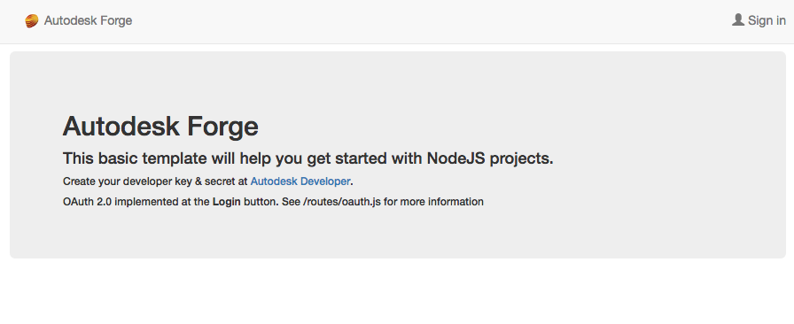

# forge-3leg.nodejs-template

# Description

This template (or boiler plate) implements a basic infrastrucutre for [Autodesk Forge 3 Legged OAuth](https://developer.autodesk.com/en/docs/oauth/v2/tutorials/get-3-legged-token/) with NodeJS. The front-end will look like:

# Setup

For using this sample, you need an Autodesk developer credentials. Visit the [Forge Developer Portal](https://developer.autodesk.com), sign up for an account, then [create an app](https://developer.autodesk.com/myapps/create). For this new app, use <b>http://localhost:3000/api/forge/callback/oauth</b> as Callback URL. Finally take note of the <b>Client ID</b> and <b>Client Secret</b>.

### Run locally

Install [NodeJS](https://nodejs.org).

Clone this project or download it. It's recommended to install [GitHub desktop](https://desktop.github.com/). To clone it via command line, use the following (<b>Terminal</b> on MacOSX/Linux, <b>Git Shell</b> on Windows):

    git clone https://github.com/augustogoncalves/forge-3leg.nodejs-template

To run it, install the required packages, set the enviroment variables with your client ID & secret and finally start it. Via command line, navigate to the folder where this repository was cloned and use the following:

Mac OSX/Linux (Terminal)

    npm install
    export FORGE_CLIENT_ID=<<YOUR CLIENT ID FROM DEVELOPER PORTAL>>
    export FORGE_CLIENT_SECRET=<<YOUR CLIENT SECRET>>
    npm run dev

Windows (use <b>Node.js command line</b> from Start menu)

    npm install
    set FORGE_CLIENT_ID=<<YOUR CLIENT ID FROM DEVELOPER PORTAL>>
    set FORGE_CLIENT_SECRET=<<YOUR CLIENT SECRET>>
    npm run dev

Open the browser: [http://localhost:3000](http://localhost:3000).

<b>Important:</b> do not use <b>npm start</b> locally, this is intended for PRODUCTION only with HTTPS (SSL) secure cookies.

### Deploy on Heroku

To deploy this application to Heroku, the <b>Callback URL</b> must use your .herokuapp.com address. After clicking on the button below, at the Heroku Create New App page, set your Client ID & Secret and the correct callback URL.

Watch [this video](https://www.youtube.com/watch?v=Oqa9O20Gj0c) on how deploy this sample to Heroku.

## What's next?

Your application endpoints should be implemented at [/server/app.js](/routes/app.js). Use the [Token](/server/token.js) module to read the Public and Internal tokens. Only send Public token to the front-end, use the Internal token to perform server-side operations with Autodesk APIs.

Below is a small section of the app.js file. Adjust the <b>get</b> method and replace <b>your_end_point</b> endpoint with your own.

    // token handling in session
    var token = require('./token');

    router.get('/your_end_point', function (req, res) {
      var tokenSession = new token(req.session);
      var tokenInternal = tokenSession.getTokenInternal();

      // ToDo: implement your application here, e.g. call Autodesk endpoints

    });

When your application is live, consider changing the <b>secure</b> attribute on [/server/server.js](/routes/server.js) to <b>true</b>

## Packages used

All Autodesk Forge NPM packages are included by default, see complete list of what's available at [NPM website](https://www.npmjs.com/browse/keyword/autodesk). Some other non-Autodesk packaged are used, including [express](https://www.npmjs.com/package/express) and its session/cookie middlewares ([express-session](https://www.npmjs.com/package/express-session) and [cookie-parser](https://www.npmjs.com/package/cookie-parser)) for user session handling. The front-end uses [bootsrap](https://www.npmjs.com/package/bootstrap) and [jquery](https://www.npmjs.com/package/jquery).

# Tips & tricks

For local development/testing, consider use [nodemon](https://www.npmjs.com/package/nodemon) package, which auto restart your node application after any modification on your code. To install it, use:

    sudo npm install -g nodemon

Then, instead of <b>npm run dev</b>, use the following:

    npm run nodemon

Which executes <b>nodemon server.js --ignore www/</b>, where the <b>--ignore</b> parameter indicates that the app should not restart if files under <b>www</b> folder are modified.

## Troubleshooting

After installing Github desktop for Windows, on the Git Shell, if you see a <b>*error setting certificate verify locations*</b> error, use the following:

    git config --global http.sslverify "false"

# License

This sample is licensed under the terms of the [MIT License](http://opensource.org/licenses/MIT).
Please see the [LICENSE](LICENSE) file for full details.

## Written by

Augusto Goncalves (Forge Partner Development) 
http://forge.autodesk.com 
